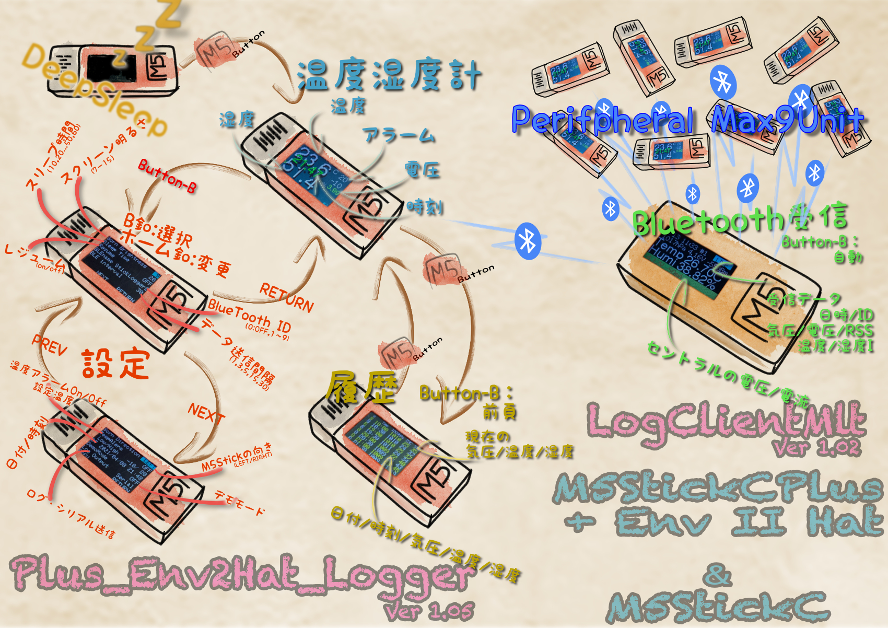

# Plus_Env2Hat_Logger

M5StickCPlus用の気温・湿度・気圧のデータ収集、およびBluetooth送信。

## 必要なもの
* M5StickCPlus
* M5StickC ENV Hat II
* Ardiono IDE
* SHT3X.h SHT3X.cpp
* NimBLE-Arduino Library

# LogClientMlt

M5StickC用のLogデータ受信。最大９台まで受信可能

## 必要なもの
* M5StickC
* Ardiono IDE
* NimBLE-Arduino Library

